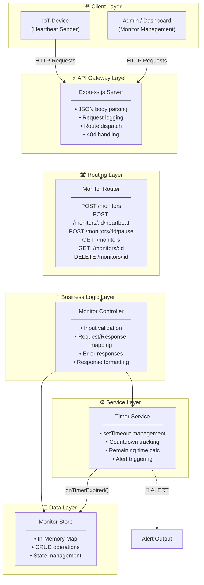
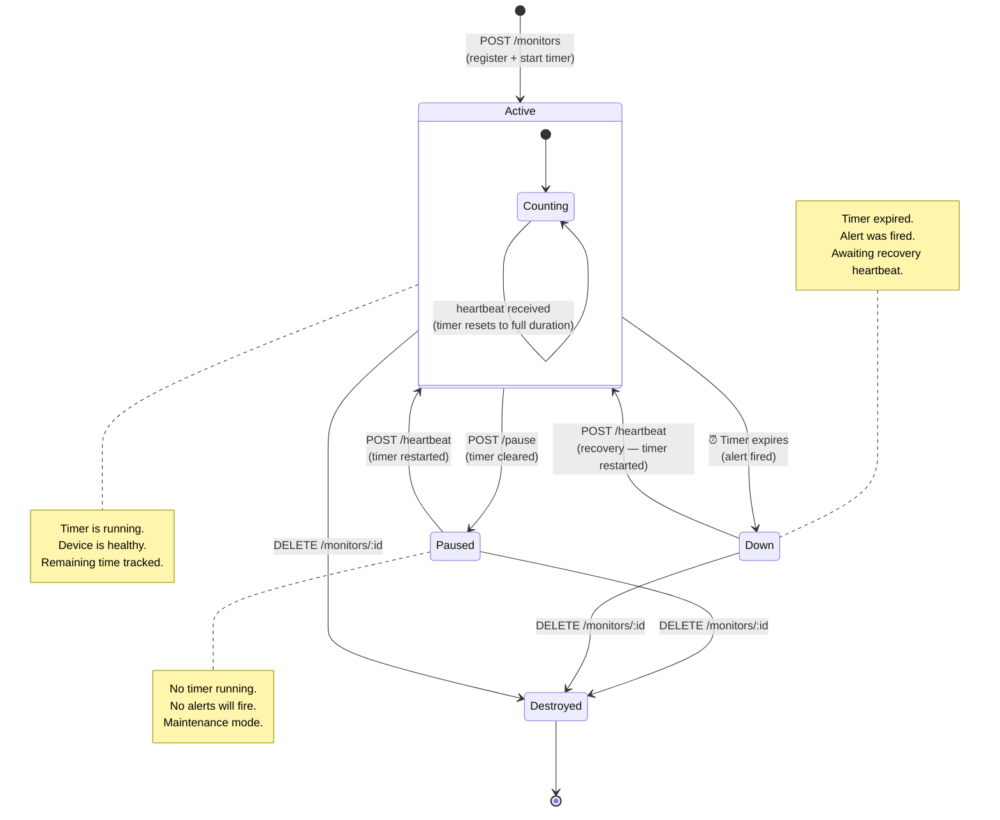

# 🫀 Pulse-Check-API

A **Dead Man's Switch API** for monitoring remote device heartbeats. Built for CritMon Servers Inc. to track solar farms and unmanned weather stations in areas with poor connectivity.

Devices register a monitor with a countdown timer. If a device fails to send a heartbeat before the timer expires, the system automatically fires an alert — no human checking required.

---

## Architecture

### High-Level System Architecture

The system follows a **layered architecture** with strict separation of concerns. Each layer only communicates with its immediate neighbor.



### Request Lifecycle — Sequence Diagram

Covers all flows including error paths (validation failures, 404s, 409 conflicts).

```mermaid
sequenceDiagram
    actor D as 📡 Device
    actor A as 👤 Admin
    participant S as Express Server
    participant C as Controller
    participant TS as Timer Service
    participant MS as Monitor Store

    rect rgb(22, 33, 62)
        Note over D, MS: ① REGISTER — POST /monitors
        D->>S: POST /monitors<br/>{"id":"device-123","timeout":60,"alert_email":"admin@critmon.com"}
        S->>C: createMonitor(req, res)
        C->>C: ✅ Validate: id, timeout > 0, alert_email
        alt Validation fails
            C-->>D: 400 Bad Request
        else ID already exists
            C->>MS: exists(id)
            MS-->>C: true
            C-->>D: 409 Conflict
        else Valid request
            C->>MS: create(id, 60, "admin@critmon.com")
            MS-->>C: { id, status: "active", timeout: 60, ... }
            C->>TS: startTimer("device-123", 60)
            TS->>TS: setTimeout(onTimerExpired, 60000ms)
            C-->>D: 201 Created + monitor object
        end
    end

    rect rgb(15, 52, 96)
        Note over D, MS: ② HEARTBEAT — POST /monitors/:id/heartbeat
        D->>S: POST /monitors/device-123/heartbeat
        S->>C: heartbeat(req, res)
        C->>MS: get("device-123")
        alt Monitor not found
            MS-->>C: undefined
            C-->>D: 404 Not Found
        else Monitor exists (active, paused, or down)
            MS-->>C: monitor object
            C->>MS: update(id, { status: "active", lastHeartbeat: now })
            C->>TS: startTimer("device-123", 60)
            TS->>TS: clearTimeout(existing)
            TS->>TS: setTimeout(onTimerExpired, 60000ms)
            C-->>D: 200 OK + updated monitor
        end
    end

    rect rgb(233, 69, 96)
        Note over D, MS: ③ TIMER EXPIRY — Automatic Alert
        TS->>TS: ⏰ 60 seconds elapsed — no heartbeat
        TS->>MS: update("device-123", { status: "down" })
        TS->>TS: 🚨 console.log({ ALERT: "Device device-123 is down!", ... })
        Note right of TS: Timer references cleaned up.<br/>Monitor persists in "down" state.
    end

    rect rgb(22, 33, 62)
        Note over A, MS: ④ PAUSE — POST /monitors/:id/pause
        A->>S: POST /monitors/device-123/pause
        S->>C: pause(req, res)
        C->>MS: get("device-123")
        alt Already paused
            C-->>A: 400 Bad Request
        else Active monitor
            C->>TS: clearTimer("device-123")
            TS->>TS: clearTimeout + remove metadata
            C->>MS: update(id, { status: "paused" })
            C-->>A: 200 OK — "Send heartbeat to resume"
        end
    end

    rect rgb(15, 52, 96)
        Note over D, MS: ⑤ RESUME — Heartbeat after pause/down
        D->>S: POST /monitors/device-123/heartbeat
        S->>C: heartbeat(req, res)
        C->>MS: update(id, { status: "active", lastHeartbeat: now })
        C->>TS: startTimer("device-123", 60)
        TS->>TS: New setTimeout(onTimerExpired, 60000ms)
        C-->>D: 200 OK — Monitor resumed
    end
```



### Monitor State Machine

Every monitor transitions through three states. A heartbeat can recover a device from any state.



---

## Project Structure

```
Pulse-Check-API/
├── src/
│   ├── server.js               
│   ├── routes/
│   │   └── monitors.js         
│   ├── controllers/
│   │   └── monitorController.js
│   ├── services/
│   │   └── timerService.js     
│   └── store/
│       └── monitorStore.js     
├── package.json
├── .gitignore
└── README.md
```

---

## Setup Instructions

### Prerequisites

- **Node.js** v18 or higher
- **npm**

### Installation

```bash
# Clone the repository
git clone https://github.com/<your-username>/Pulse-Check-API.git
cd Pulse-Check-API

# Install dependencies
npm install
```

### Running the Server

```bash
# Production
npm start

# Development (auto-restart on file changes)
npm run dev
```

The server starts on `http://localhost:3000` by default. Set the `PORT` environment variable to change it:

```bash
PORT=8080 npm start
```

### Verify It's Running

```bash
curl http://localhost:3000/health
```

```json
{
  "status": "ok",
  "service": "Pulse-Check-API",
  "uptime": 5.123,
  "timestamp": "2026-04-02T20:00:00.000Z"
}
```

---

## API Documentation

### Base URL

```
http://localhost:3000
```

### Endpoints

#### `POST /monitors` — Register a Monitor

Creates a new monitor and starts its countdown timer.

**Request Body:**
```json
{
  "id": "device-123",
  "timeout": 60,
  "alert_email": "admin@critmon.com"
}
```

| Field | Type | Description |
|---|---|---|
| `id` | string | Unique device identifier |
| `timeout` | number | Countdown duration in seconds (must be > 0) |
| `alert_email` | string | Email address to alert on timeout |

**Responses:**

| Status | Description |
|---|---|
| `201 Created` | Monitor created successfully |
| `400 Bad Request` | Missing or invalid fields |
| `409 Conflict` | Monitor with this ID already exists |

**Example:**
```bash
curl -X POST http://localhost:3000/monitors \
  -H "Content-Type: application/json" \
  -d '{"id": "device-123", "timeout": 60, "alert_email": "admin@critmon.com"}'
```

```json
{
  "message": "Monitor created for device-123",
  "monitor": {
    "id": "device-123",
    "status": "active",
    "timeout": 60,
    "remaining": 60,
    "alert_email": "admin@critmon.com",
    "last_heartbeat": "2026-04-02T20:00:00.000Z",
    "created_at": "2026-04-02T20:00:00.000Z"
  }
}
```

---

#### `POST /monitors/:id/heartbeat` — Send Heartbeat

Resets the countdown timer. Also resumes monitoring if the device was paused or down.

**Responses:**

| Status | Description |
|---|---|
| `200 OK` | Timer reset successfully |
| `404 Not Found` | Monitor ID does not exist |

**Example:**
```bash
curl -X POST http://localhost:3000/monitors/device-123/heartbeat
```

```json
{
  "message": "Heartbeat received. Timer reset.",
  "monitor": {
    "id": "device-123",
    "status": "active",
    "timeout": 60,
    "remaining": 60,
    "alert_email": "admin@critmon.com",
    "last_heartbeat": "2026-04-02T20:01:00.000Z",
    "created_at": "2026-04-02T20:00:00.000Z"
  }
}
```

---

#### `POST /monitors/:id/pause` — Pause Monitoring

Stops the countdown timer. No alerts will fire while paused. Send a heartbeat to resume.

**Responses:**

| Status | Description |
|---|---|
| `200 OK` | Monitor paused |
| `400 Bad Request` | Monitor is already paused |
| `404 Not Found` | Monitor ID does not exist |

**Example:**
```bash
curl -X POST http://localhost:3000/monitors/device-123/pause
```

```json
{
  "message": "Monitor 'device-123' has been paused. Send a heartbeat to resume.",
  "monitor": {
    "id": "device-123",
    "status": "paused",
    "timeout": 60,
    "remaining": null,
    "alert_email": "admin@critmon.com",
    "last_heartbeat": "2026-04-02T20:01:00.000Z",
    "created_at": "2026-04-02T20:00:00.000Z"
  }
}
```

---

#### `GET /monitors` — List All Monitors

Returns all registered monitors with their current status and remaining time.

**Example:**
```bash
curl http://localhost:3000/monitors
```

```json
{
  "count": 2,
  "monitors": [
    {
      "id": "device-123",
      "status": "active",
      "timeout": 60,
      "remaining": 45,
      "alert_email": "admin@critmon.com",
      "last_heartbeat": "2026-04-02T20:01:00.000Z",
      "created_at": "2026-04-02T20:00:00.000Z"
    },
    {
      "id": "weather-station-7",
      "status": "down",
      "timeout": 120,
      "remaining": null,
      "alert_email": "ops@critmon.com",
      "last_heartbeat": "2026-04-02T19:50:00.000Z",
      "created_at": "2026-04-02T19:48:00.000Z"
    }
  ]
}
```

---

#### `GET /monitors/:id` — Get Monitor Details

Returns details for a single monitor including real-time remaining countdown.

**Responses:**

| Status | Description |
|---|---|
| `200 OK` | Monitor details returned |
| `404 Not Found` | Monitor ID does not exist |

**Example:**
```bash
curl http://localhost:3000/monitors/device-123
```

---

#### `DELETE /monitors/:id` — Delete a Monitor

Removes the monitor and clears its timer permanently.

**Responses:**

| Status | Description |
|---|---|
| `200 OK` | Monitor deleted |
| `404 Not Found` | Monitor ID does not exist |

**Example:**
```bash
curl -X DELETE http://localhost:3000/monitors/device-123
```

```json
{
  "message": "Monitor 'device-123' has been deleted"
}
```

---

#### `GET /health` — Health Check

Returns the service status and uptime.

```bash
curl http://localhost:3000/health
```
